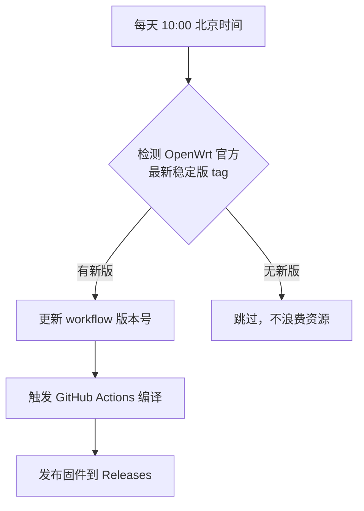

<div align="center">


<br/><br/>

# 🛡️ OpenWrt x86-64 官方源码编译固件

**自动追踪 OpenWrt 官方最新稳定版 · 全中文面板 · 预装常用插件**

[📥 下载固件](#-固件下载) · [🚀 快速开始](#-安装指南) · [⚙️ 预装插件](#%EF%B8%8F-预装插件) · [❓ 常见问题](#-常见问题)

</div>

---

## ✨ 项目特点

| 特性 | 说明 |
|------|------|
| 🧬 **官方纯净源码** | 基于 OpenWrt Official 最新稳定版，从源码编译 |
| 🔄 **自动追踪更新** | 每日检测 OpenWrt 官方新版本，发现更新自动编译 |
| 🇨🇳 **全中文面板** | 所有 LuCI 插件均包含中文语言包 |
| 🌐 **OpenClash** | 预装 Meta 内核（mihomo），支持 Rule-Based 分流 |
| 🔍 **Dnsmasq 完整版** | 替换默认版，支持更多 DNS 功能，已解决与 OpenClash 冲突 |
| 📺 **KMS 激活** | 预装 vlmcsd，自动激活 Windows / Office |
| 🔗 **ZeroTier** | 内网穿透，随时随地访问家庭网络 |
| 🚫 **IPv6 关闭** | 默认禁用 IPv6，适合纯 IPv4 环境 |
| 🎯 **编译精简** | 仅输出 `.img.gz` + `.vmdk` 两种实用格式 |

---

## 📥 固件下载

前往 **[Releases](https://github.com/zhuyihua12/openwrt-x86-official/releases)** 页面下载最新版本。

| 文件格式 | 适用场景 | 推荐度 |
|----------|----------|--------|
| `.img.gz` | 物理机写入 U 盘/SSD，导入 PVE/ESXi/Unraid/VirtualBox | ⭐⭐⭐⭐⭐ |
| `.vmdk` | VMware Workstation / ESXi 直接导入 | ⭐⭐⭐⭐ |

> 💡 每次 OpenWrt 官方发布新稳定版后，本项目会自动检测并重新编译，确保固件始终保持最新。

---

## 🚀 安装指南

### 物理机安装（U 盘 / SSD）

**Windows:** 推荐 [Rufus](https://rufus.ie/) 写入。

**Linux / macOS:**
```bash
gunzip openwrt-x86-64-combined.img.gz
sudo dd if=openwrt-x86-64-combined.img of=/dev/sdX bs=4M status=progress && sync
```
> ⚠️ 将 `/dev/sdX` 替换为实际设备，此操作会清空目标设备！

### 虚拟机安装（PVE）
```bash
gunzip openwrt-x86-64-combined.img.gz
qm importdisk 100 openwrt-x86-64-combined.img local-lvm
```
> 网卡建议选择 VirtIO（PVE）或 VMXNET3（ESXi）。

### VMware 直接使用
`.vmdk` 格式可直接挂载到 VMware Workstation / ESXi 虚拟机使用。

---

## 🔑 首次登录

| 项目 | 默认值 |
|------|--------|
| 管理地址 | `http://192.168.80.80` |
| 用户名 | `root` |
| 密码 | *(空)* |
| 主机名 | `OpenWrt` |
| 时区 | `Asia/Shanghai (CST-8)` |

> ⚠️ 默认 LAN IP 为 `192.168.80.80`，请确保电脑与路由器在同一网段。

---

## ⚙️ 预装插件

**🌐 网络代理**
- `luci-app-openclash` — OpenClash Meta 内核，Rule-Based 分流

**🔍 DNS 服务**
- `dnsmasq-full` — Dnsmasq 完整版，已解决与 OpenClash 冲突

**🔗 网络工具**
- `zerotier` + `luci-app-zerotier` — 内网穿透

**🖥️ 系统服务**
- `vlmcsd` + `luci-app-vlmcsd` — KMS 激活服务器
- `luci-app-ttyd` — Web 终端
- `openssh-sftp-server` — SFTP 文件传输
- `vsftpd` — FTP 服务

**🛠️ 实用工具**
- `curl` / `wget-ssl` — 命令行下载
- `htop` — 系统监控
- `nano` — 文本编辑器

**🌍 全中文支持**
- 所有 LuCI 插件均安装中文语言包

---

## 🔄 自动构建机制

本项目的构建策略是 **智能追踪，有更新才编译**：



| 触发方式 | 说明 |
|----------|------|
| 🤖 **智能检测** | 每日 10:00 自动检查 OpenWrt 官方是否有新稳定版 |
| 🖱️ **手动触发** | 需要时可通过 Workflow Dispatch 手动编译 |
| ⏰ ~~定时编译~~ | ~~已移除，改为按需编译~~ |

> 🎯 只有在 OpenWrt 官方发布新稳定版时才会触发编译，避免频繁无意义的构建。

---

## 📄 许可证

- **OpenWrt** — [GPL-2.0](https://github.com/openwrt/openwrt/blob/main/LICENSE)
- **本项目脚本** — [MIT License](LICENSE)

---

<div align="center">

如果这个项目对您有帮助，请点一个 ⭐ **Star** 支持一下！

Made with ❤️ by [zhuyihua12](https://github.com/zhuyihua12)

</div>
